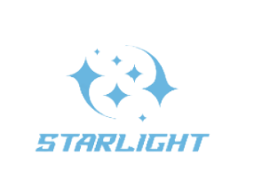

[//]: # (# StarLight)
<div align=center>

</div>


StarLight helps in obtaining lightweight deep neural networks. StarLight consists primarily of three modules: network compression, neural architecture search, and visualization. The network compression module uses pruning and quantization techniques to convert a pre-trained network into a lightweight structure. The neural architecture search module designs efficient structures by utilizing differentiable architecture search methods. The visualization window can display all of the aforementioned processes, as well as visualizations of network intermediate features. We further provide a convenient tool [QuiverPyTorch](https://github.com/ICT-ANS/StarLight/tree/main/quiver_pytorch) to visualize the intermediate features of any networks.

<div align="center">
  <h3>
    <a href="https://ict-ans.github.io/StarLight.github.io/docs/Installation.html">
      Installation
    </a>
    <span> | </span>
    <a href="https://github.com/ICT-ANS/StarLight">
      Tutorials
    </a>
    <span> | </span>
    <a href="https://ict-ans.github.io/StarLight.github.io/">
      Documentation
    </a>
    <span> | </span>
    <a href="https://github.com/ICT-ANS/StarLight/tree/main/quiver_pytorch">
      QuiverPyTorch
    </a>
    <span> | </span>
    <a href="https://github.com/ICT-ANS/StarLight/issues">
      FAQs
    </a>
  </h3>
</div>

---

## Table of Contents
- [Highlighted Features](#highlighted-features)
- [Available Algorithms](#available-algorithms)
- [Demo](#demo)
- [Installation](#installation)
- [Getting Started](#getting-started)
  - [Basic usage](#basic-usage)
  - [Examples](#examples)
- [Guide for compressing your own networks](#guide-for-compressing-your-own-networks)
- [License](#license)
- [Acknowledgments](#acknowledgments)
- [Citation](#citation)
- [Contributing](#contributing)

## Highlighted Features
* We present lightweight results of **6 popular networks**, including image classification, semantic segmentation, and object detection. 
* We have collected **xxx bugs and solutions** during experiments in [Bug Summary](https://ict-ans.github.io/StarLight.github.io/docs/Bug%20Summary.html), which can enable an efficient lightweight experience when dealing with your own networks. 
* With **just 1 yaml file**, you can easily visualize your own lightweight networks in StarLight. 
* In addition to 2D convolution pruning, we also provide **support for 3D convolution pruning**. Please refer to our [Documentation](https://ict-ans.github.io/StarLight.github.io/) for more details.
* To handle the unrecognized operations in ONNX models, we have collected **6 plugins for network quantization**, which will be available soon. 
* We provide a convenient tool to visualize the network intermediate features, namely [QuiverPyTorch](https://github.com/ICT-ANS/StarLight/tree/main/quiver_pytorch).


## Available Algorithms

* Available tasks

| Task Type             |      Pruning       |    Quantization     | Neural Architecture Search |
|-----------------------|:------------------:|:-------------------:|:--------------------------:|
| Image classification  | :white_check_mark: | :white_check_mark:  |     :white_check_mark:     | :white_check_mark: | :white_check_mark: |
| Semantic Segmentation | :white_check_mark: | :white_check_mark:  |                            | |
| Object Detection      | :white_check_mark: | :white_check_mark:  |                            | |

* Available algorithms

| Method                       |          Algorithms          |
|------------------------------|:----------------------------:|
| Pruning                      |  AGP, FPGM, Taylor, L1, L2   |
| Quantization                 |       QAT        |
| Neural Architecture Search  | DARTS, GDAS, DU-DARTS, DDSAS |


## Demo
* Pruning, quantization and feature visualization in StarLight. 


* Neural architecture search and feature visualization in StarLight. 


## Installation
* We summarized detailed steps for installation [here](https://ict-ans.github.io/StarLight.github.io/docs/Installation.html).

## Getting Started
### Basic usage
* Coming soon.


## Guide for compressing your own networks
You can easily compress your own networks according to our [Compress Guide](https://ict-ans.github.io/StarLight.github.io/docs/Compress%20Guide.html).


## Visualize your own networks in StarLight
With **just 1 yaml file**, you can conveniently visualize your own lightweight networks in StarLight. Please refer to the [Visualization in StarLight](https://ict-ans.github.io/StarLight.github.io/docs/Visualization%20in%20StarLight.html) for more details.

## Acknowledgments
* This work is funded by xxx xxx xxx.
* We owe a debt of gratitude to xxx, xxx and xxx for reading the manuscript and providing valuable feedback.
* We would like to thank xxx xxx for invaluable advice on the presentation of the document.


## Citation
If you find that this project helps your research, you can cite StarLight as following:
```
@misc{StarLight,
  author    = {xxx and xxx and xxx and xxx and xxx,
  year      = {2023},
  publisher = {StarLight},
  address   = {Institute of Computing Technology, Chinese Academy of Sciences},
  title     = {StarLight: xxxxxxxxxxxxxxxxxxxxxxx},
  url       = {https://github.com/ICT-ANS/StarLight}
}
```


## Contributing
Thanks for your interest in [StarLight](https://github.com/ICT-ANS/StarLight) and for willing to contribute! We'd love to hear your feedback. 

### Reporting Bugs
* Please first try to check if an issue exists in our [Bug Summary](https://github.com/ICT-ANS/StarLight) or `Issue`. 
* If not, please describe the bug in detail and we will give a timely reply. 

### Commiting New Models
* We are happy to integrate your network to our StarLight. Please provide your network with the results and hyper-parameters to us. And a detailed description would be better. Thank you!

## License
This project is under the MIT license - please see the [LICENSE](https://github.com/ICT-ANS/StarLight) for details