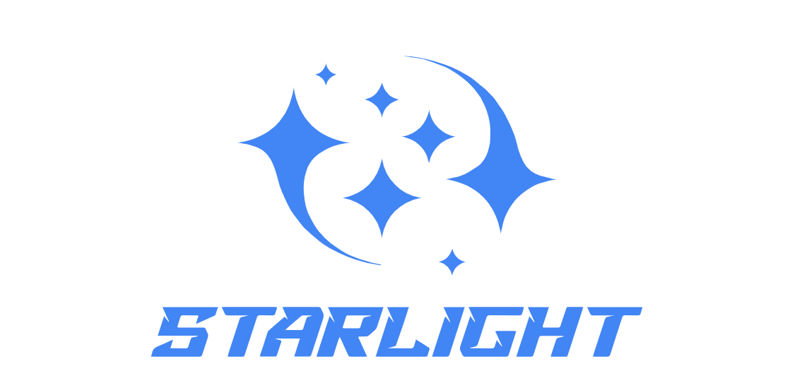

[//]: # (# StarLight)
<div align=center>

</div>


StarLight helps in obtaining lightweight deep neural networks. StarLight consists primarily of three modules: network compression, neural architecture search, and visualization. The network compression module uses pruning and quantization techniques to convert a pre-trained network into a lightweight structure. The neural architecture search module designs efficient structures by utilizing differentiable architecture search methods. The visualization window can display all of the aforementioned processes, as well as visualizations of network intermediate features. We further provide a convenient tool [QuiverPyTorch](https://github.com/ICT-ANS/StarLight/tree/main/quiver_pytorch) to visualize the intermediate features of any networks.

<div align="center">
  <h3>
    <a href="https://ict-ans.github.io/StarLight.github.io/">
      Home
    </a>
    <span> | </span>
    <a href="https://ict-ans.github.io/StarLight.github.io/docs/Installation.html">
      Installation
    </a>
    <span> | </span>
    <a href="https://ict-ans.github.io/StarLight.github.io/docs/Compress%20Guide.html">
      Compress Guide
    </a>
    <span> | </span>
    <a href="https://ict-ans.github.io/StarLight.github.io/docs/Bug%20Summary%20(EN).html">
      Bug Summary
    </a>
    <span> | </span>
    <a href="https://github.com/ICT-ANS/StarLight/tree/main/quiver_pytorch">
      QuiverPyTorch
    </a>
  </h3>
</div>

---

## Table of Contents
- [Highlighted Features](#highlighted-features)
- [Available Algorithms](#available-algorithms)
- [Demo](#demo)
- [Installation](#installation)
- [Getting Started](#getting-started)
  - [Network Compression](#network-compression)
  - [Neural Architecture Search](#neural-architecture-search)
  - [Compression Visualization in StarLight](#compression-visualization-in-starlight)
  - [NAS Visualization in StarLight](#nas-visualization-in-starlight)
- [Guide for compressing your own networks](#guide-for-compressing-your-own-networks)
- [Visualize your own networks in StarLight](#visualize-your-own-networks-in-starlight)
- [Acknowledgments](#acknowledgments)
- [Citation](#citation)
- [Contributing](#contributing)
  - [Reporting Bugs](#report-bugs)
  - [Commit New Networks](#commit-new-networks)
- [License](#license)

## Highlighted Features
* We present lightweight results of **6 popular networks**, including image classification, semantic segmentation, and object detection. 
* We have collected **over 50 bugs and solutions** during experiments in [Bug Summary](https://ict-ans.github.io/StarLight.github.io/docs/Bug%20Summary%20(EN).html), which can enable an efficient lightweight experience when dealing with your own networks. 
* With **just 1 yaml file**, you can easily visualize your own lightweight networks in StarLight. 
* In addition to 2D convolution pruning, we also provide **support for 3D convolution pruning**. Please refer to our [Manually Export (3D-Conv)](https://ict-ans.github.io/StarLight.github.io/docs/Manually%20Export%20(3D-Conv).html) for more details.
* To handle the unrecognized operations in ONNX models, we have collected **6 plugins for network quantization**, which will be available soon. 
* We provide a convenient tool to visualize the network intermediate features, namely [QuiverPyTorch](https://github.com/ICT-ANS/StarLight/tree/main/quiver_pytorch).


## Available Algorithms

* Available tasks

| Task Type             |      Pruning       |    Quantization     | Neural Architecture Search |
|-----------------------|:------------------:|:-------------------:|:--------------------------:|
| Image classification  | :white_check_mark: | :white_check_mark:  |     :white_check_mark:     | :white_check_mark: | :white_check_mark: |
| Semantic Segmentation | :white_check_mark: | :white_check_mark:  |                            | |
| Object Detection      | :white_check_mark: | :white_check_mark:  |                            | |

* Available algorithms

| Method                       |                                                                                                            Algorithms                                                                                                            |
|------------------------------|:--------------------------------------------------------------------------------------------------------------------------------------------------------------------------------------------------------------------------------:|
| Pruning                      | [AGP](https://arxiv.org/abs/1710.01878), [FPGM](https://github.com/he-y/filter-pruning-geometric-median), [Taylor](http://jankautz.com/publications/Importance4NNPruning_CVPR19.pdf), [L1](https://arxiv.org/abs/1608.08710), L2 |
| Quantization                 |                                                                  [PTQ](https://docs.nvidia.com/deeplearning/tensorrt/developer-guide/index.html#enable_int8_c)                                                                   |
| Neural Architecture Search  |  [DARTS](https://github.com/quark0/darts), [GDAS](https://github.com/D-X-Y/AutoDL-Projects/blob/main/docs/CVPR-2019-GDAS.md), [DU-DARTS](https://github.com/ShunLu91/DU-DARTS), [DDSAS](https://github.com/xingxing-123/DDSAS)   |


## Demo
* Pruning, quantization and feature visualization in StarLight. 


* Neural architecture search and feature visualization in StarLight. 


## Installation
* We summarized detailed steps for installation in this [link](https://ict-ans.github.io/StarLight.github.io/docs/Installation.html).

## Getting Started
After installing the required packages for StarLight, activate the environment to enjoy StarLight.
```shell
conda activate starlight
```


### Network compression
- Go to the folder of `algorithms/compression/nets`. 
```shell
cd algorithms/compression/nets
```
- Select a provided network such as ResNet, DeepLabV3Plus, PSPNet, ResNet50_SSD, or VGG_SSD
- Follow the `README.md` in each folder of the network to compress them.
- Note that ResNet50_SSD and VGG_SSD both require `cpu_nms`, which needs to be compiled manually. Go to the folder of `algorithms/compression/nets/ResNet50_SSD/SSD_Pytorch` or 
`algorithms/compression/nets/VGG_SSD`. Please ensure that `cpython-36m` in `make.sh` is consistent with the version of your installed Python. Finally, simply run:
```shell
./make.sh
```

### Neural Architecture Search
- Go to the folder of `algorithms/nas`. 
```shell
cd algorithms/nas
```
- Select a provided NAS algorithm such as DARTS, GDAS, DDSAS or DU-DARTS. 
- Follow the `README.md` in each folder of the NAS algorithm to conduct experiments.


### Compression Visualization in StarLight
- Download logs and pre-trained weights in `compression` from [Baidu Netdisk](https://pan.baidu.com/s/1pguXQfGXODO34HliAj1qKg) with the password `star`. 
- Create the data folder under `StarLight` and add a soft link for `compression`.
```shell
cd StarLight && mkdir data
cd data && ln -s /path/to/compression
```
- Go to the folder of `StarLight` and run visualization for compression:
```shell
cd StarLight
python compression_vis/compression.py
```

### NAS Visualization in StarLight
- Download logs and pre-trained weights in `StarLight_Cache` from [Baidu Netdisk](https://pan.baidu.com/s/1pguXQfGXODO34HliAj1qKg) with the password `star`. 
- Go to the data folder under StarLight and add a soft link for `StarLight_Cache`.
```shell
cd data && ln -s /path/to/StarLight_Cache
```
- Go to the folder of `nas_vis` and run visualization for NAS:
```shell
cd StarLight/nas_vis
python nas.py
```


## Guide for compressing your own networks
You can easily compress your own networks according to our [Compress Guide](https://ict-ans.github.io/StarLight.github.io/docs/Compress%20Guide.html).


## Visualize your own networks in StarLight
With **just 1 yaml file**, you can conveniently visualize your own lightweight networks in StarLight. Please refer to the [Visualization in StarLight](https://ict-ans.github.io/StarLight.github.io/docs/Visualization%20in%20StarLight.html) for more details.


## Acknowledgments
* This work is supported in part by the National Key R&D Program of China under Grant No. 2018AAA0102701 and in part by the National Natural Science Foundation of China under Grant No. 62176250 and No. 62203424.
* The following people have helped test the StarLight toolkit, read the document and provid valuable feedback: Pengze Wu, Haoyu Li, and Jiancong Zhou.
* Our StarLight framework is built on top of [NNI](https://github.com/microsoft/nni), incorporating their pruning and quantization algorithms. We extend our gratitude to NNI for their remarkable contributions.
* We would like to thank [Just the Docs](https://github.com/just-the-docs/just-the-docs) for providing the template for our document. 
* We would like to thank ChatGPT for polishing the presentation of the document.


## Citation
If you find that this project helps your research, you can cite StarLight as following:
```
@misc{StarLight,
  author    = {Shun Lu and Longxing Yang and Zihao Sun and Jilin Mei and Yu Hu,
  year      = {2023},
  address   = {Institute of Computing Technology, Chinese Academy of Sciences},
  title     = {StarLight: An Open-Source AutoML Toolkit for Lightweighting Deep Neural Networks},
  url       = {https://github.com/ICT-ANS/StarLight}
}
```

## Contributing
Thanks for your interest in [StarLight](https://github.com/ICT-ANS/StarLight) and for willing to contribute! We'd love to hear your feedback. 

### Report Bugs
* Please first try to check if an issue exists in our [Bug Summary](https://github.com/ICT-ANS/StarLight) or [Issues](https://github.com/ICT-ANS/StarLight/issues). 
* If not, please describe the bug in detail and we will give a timely reply. 

### Commit New Networks
* We are happy to integrate your network to our StarLight. Please provide your network with the results and hyper-parameters to us. And a detailed description would be better. Thank you!

## License
This project is under the MIT license - please see the [LICENSE](https://github.com/ICT-ANS/StarLight/blob/main/LICENSE) for details.