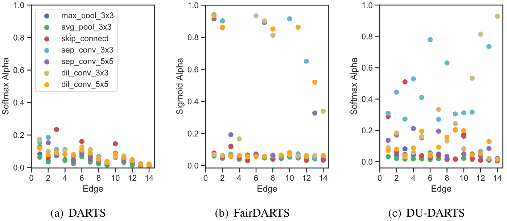

# DU-DARTS: Decreasing the Uncertainty of Differentiable Architecture Search (BMVC 2021)


**This code is re-organized based on the official release [DU-DARTS](https://github.com/ShunLu91/DU-DARTS).**. 


## Requirements
* Python 3.7.10
* PyTorch 1.7.1


## Usage

### Model Evaluation
Pre-trained checkpoints and experimental logs are released [here](https://drive.google.com/drive/folders/1Re7b5wEcPP1GeRqL7Zh28LhsV2OKyfbM?usp=sharing).

To evaluate a pre-trained DU-DARTS model on CIFAR-10, run:
```shell
python evaluate_cifar.py --arch du_darts_c10_s0 --dataset cifar10 --pretrained_ckpt ./pretrained/c10_s0_best_weights.pt
```

To evaluate a pre-trained DU-DARTS model on CIFAR-100, run:
```shell
python evaluate_cifar.py --arch du_darts_c100_s0 --dataset cifar100 --pretrained_ckpt ./pretrained/c100_s0_best_weights.pt
```

To evaluate a pre-trained DU-DARTS model on ImageNet, run:
```shell
python evaluate_imagenet.py --arch du_darts_c100_s0 --pretrained_ckpt ./pretrained/c10_imagenet_transfer_best_model.pth
```

### Model Search
To search a DU-DARTS model on CIFAR-10, run:
```shell
python train_search.py  --arch_name du_darts_c10_s0 --layers 8 --loss_type entropy --dataset cifar10
```

To search a DU-DARTS model on CIFAR-100, run:
```shell
python train_search.py  --arch_name du_darts_c100_s0 --layers 5 --loss_type entropy --dataset cifar100
```

### Model Retraining
To retrain a DU-DARTS model on CIFAR-10, run:
```shell
python retrain_cifar.py  --arch du_darts_c10_s0 --dataset cifar10 --auxiliary --cutout
```

To retrain a DU-DARTS model on CIFAR-100, run:
```shell
python retrain_cifar.py  --arch du_darts_c100_s0 --dataset cifar100 --auxiliary --cutout
```

To retrain a DU-DARTS model on ImageNet, run:
```shell
python -u retrain_imagenet.py --arch du_darts_c100_s0 --auxiliary
```

## Citation
Please cite our paper if you find anything helpful.
```
@inproceedings{lu2021dudarts,
        title={DU-DARTS: Decreasing the Uncertainty of Differentiable Architecture Search},
        author={Lu, Shun and Hu, Yu and Yang, Longxing and Sun, Zihao and Mei, Jilin and Zeng Yiming and Li, Xiaowei },
        booktitle={BMVC},
        year={2021}
}
```


## License
MIT License

## Acknowledgement
This code is heavily borrowed from [DARTS](https://github.com/quark0/darts) and [SGAS](https://github.com/lightaime/sgas). Great thanks to their contributions.
