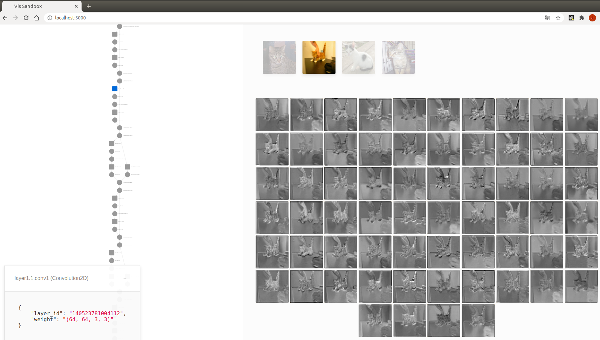

# QuiverPyTorch: an interactive CNN visualization tool for PyTorch

To visualize the intermediate features of each layer in a CNN, we add hooks for each layer and export the features using the pseudo-colors for better visualization. We integrate our tool into a web viewer, which enables interactive and convenient visualization of the intermediate features. Additionally, we provide single-thread and multi-thread examples for users to visualize features of different models in a single process. 
Our code is based on the [Quiver for Keras](https://github.com/keplr-io/quiver).


## Installation

```shell
pip install opencv-python flask flask_cors numpy gevent imageio
```

* if pytorch>=1.5.0 has been installed, just skip this:

```shell
pip install torch==1.5.1+cpu torchvision==0.6.1+cpu -f https://download.pytorch.org/whl/torch_stable.html
```

## Usage

1. Use QuiverPyTorch in your code with 3 steps:
```python
    # 1.define model
    model = models.alexnet(pretrained=False)
    # 2.register hook function for conv. layers
    hook_list = register_hook(model) 
    # 3.start
    server.launch(model, hook_list, input_folder="./data/Cat", image_size=[50,50], use_gpu=False, port=5001)
```

2. run sample.py or sample_thread.py in terminal : 

```
    python sample.py
```

3. Open web browser and go to the url: http://localhost:5001/ 




## Reference

- https://github.com/keplr-io/quiver
- https://github.com/szagoruyko/pytorchviz/tree/master/

