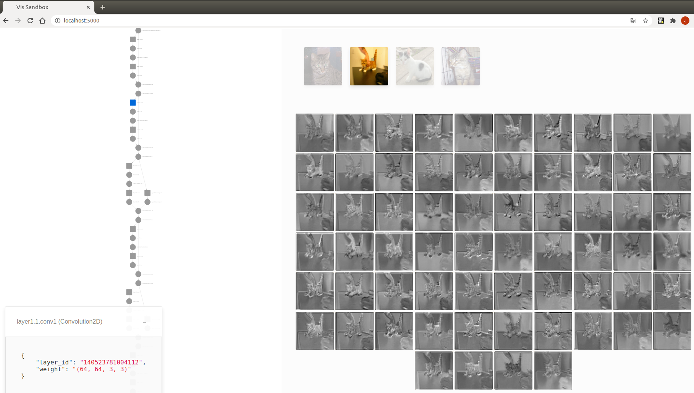

#### QuiverPytorch: interactive CNN visualization tool for pytorch

##### Install：

```shell
pip install opencv-python flask flask_cors numpy gevent imageio
```

if pytorch>=1.5.0 has been installed, just skip this:

```shell
pip install torch==1.5.1+cpu torchvision==0.6.1+cpu -f https://download.pytorch.org/whl/torch_stable.html
```

##### Usage:

```python
'''Use QuiverPytorch in your code with 3 steps'''
#1.define model
model = models.resnet18() 
#2.register hook function for conv. layers
hook_list = register_hook(model) 
#3.start
server.launch(model, hook_list, input_folder="./data/Cat", image_size=[50,50], use_gpu=False)
```

1. run sample.py or sample_thread.py in terminal : 

```
python sample.py
```

2. open web browser and input url: http://localhost:5000/ 



##### TODO：

- [ ] parameterize image size for visualization
- [ ] show network output 

##### Reference：

- https://github.com/keplr-io/quiver
- https://github.com/szagoruyko/pytorchviz/tree/master/

